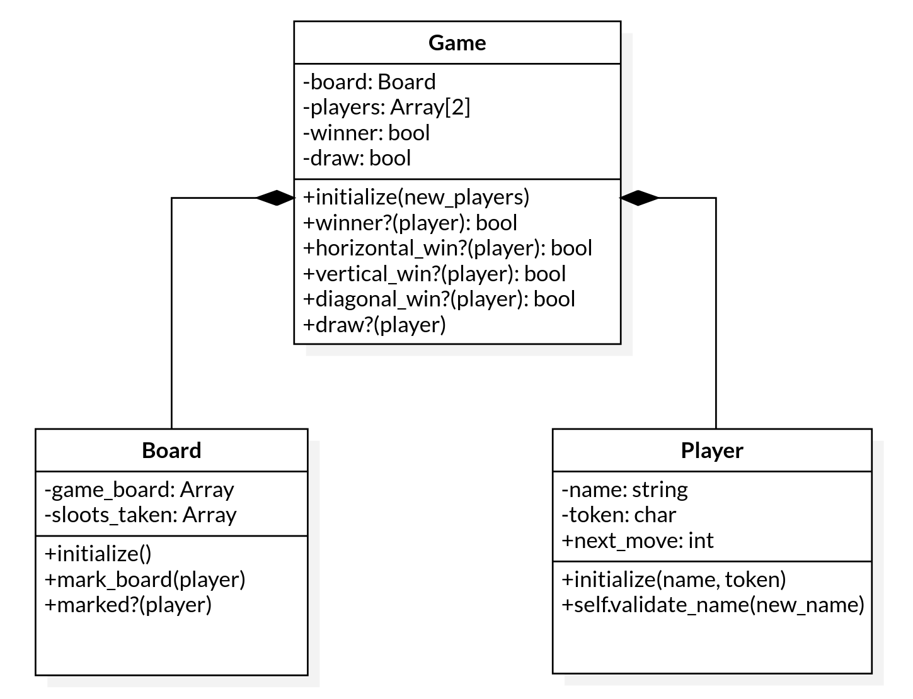

# Tic Tac Toe Ruby Game (The Odin Project)

> This is a Tic Tac Toe game made with Ruby. It's a part of the Microverse Ruby Curriculum and The Odin Project. 

## Built using

- Ruby
- Gitflow Workflow

## UML Class diagram



## Project requirements
- All user interaction and game flow should be kept only in main.rb
- Use OOP

## Live Demo
[Live preview](https://gitpod.io/github.com/marcoshdezcam/Tic_Tac_Toe_Game/tree/feature_readme_game_instructions)

## Getting Started

### How to run the game?
1 -> Clone this repo and open a terminal inside the folder where you extracted it.

2 -> Run `./bin/main.rb` in your terminal

### Game rules:
- The game board is a 3x3 grid.
- This first player will have the 'X' token and the second player the 'O' token. 
- The objective of the game is to complete a line with the player's token. These lines can be horizontal, vertical, or diagonal. And, a line is composed of 3 slots. 
```
  | X |  | X |  | X |       | O |  |   |  |   |       |   |  |   |  | X |
  |   |  |   |  |   |       | O |  |   |  |   |       |   |  | X |  |   |
  |   |  |   |  |   |       | O |  |   |  |   |       | X |  |   |  |   |
```
- Mark the board using numbers from 1 to 9 based on the next map:
```
  | 1 |  | 2 |  | 3 |
  | 4 |  | 5 |  | 6 |
  | 7 |  | 8 |  | 9 |
```
- Continue marking the board one player after the other until the same token forms a line or the slots run out. 

### Prerequisites

- Ruby

## Authors

👤 **Marcos Hernández Campos**
- Github: [@marcoshdezcam](https://github.com/marcoshdezcam)
- Twitter: [@MarcosHCampos](https://twitter.com/MarcosHCampos)
- Linkedin: [Marcos Hernández](https://linkedin.com/marcos-hernández-56058119a/)

👤 **Adesoji Adewumi**
- Github: [@AdesojiCodeMaster](https://github.com/AdesojiCodeMaster) 
- Twitter: [@codemas22665735](https://twitter.com/codemas22665735) 
- Linkedin: [linkedin](https://www.linkedin.com/in/adesoji-adewumi-7752aba5)

## 🤝 Contributing

Contributions, issues and feature requests are welcome!

Feel free to check the [issues page](issues/).

## Show your support

Give a ⭐️ if you like this project!

## 📝 License

This project is [MIT](lic.url) licensed.
